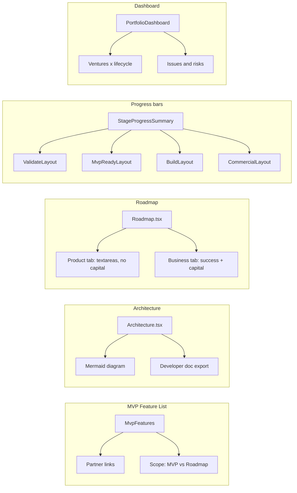

# MVP, Roadmap, Progress Bars & Portfolio Dashboard

## 1. MVP Feature List: Design Partner Links + MVP vs Roadmap

**Current state**

- [MvpFeatures.tsx](src/features/validate/MvpFeatures.tsx) already has a "Partners" column showing `requestedByPartnerIds` as comma-separated names (from `partnerNameMap`). There is no clickable link to the design partner.
- [MvpFeatureItem](src/types/venture.ts) has `requestedByPartnerIds?: string[]` but no field for "in MVP" vs "in roadmap".

**Changes**

- **Clear link to design partners**: In the Partners column, render each partner as a link (e.g. to `/validate/design-partners` with optional hash or query to scroll/highlight that candidate by id). Reuse [DesignPartnerCandidate](src/types/venture.ts) id; ensure Design Parters page can deep-link or show a "View in Design Partners" for each ID. Minimal option: make partner names link to `/validate/design-partners` and add a `?highlight=<candidateId>` so Design Parters page scrolls to or highlights that candidate.
- **MVP vs Roadmap**: Add to [MvpFeatureItem](src/types/venture.ts) a field such as `scope: 'mvp' | 'roadmap'` (default `'mvp'` for backward compatibility). In [MvpFeatures.tsx](src/features/validate/MvpFeatures.tsx), add a column (or inline control) to toggle each feature between MVP and Roadmap. Persist via existing `updateVenture` / `mvpFeatureList`. When generating or exporting roadmap/PRDs, filter or tag features by this scope where relevant.

**Data / migration**

- Existing features without `scope` are treated as `mvp`. Optional: backfill in hydrate or in UI on first load.

---

## 2. Architecture: Diagram + Developer Document

**Current state**

- [Architecture.tsx](src/features/mvp-ready/Architecture.tsx) shows text sections (techStack, componentDiagram, integrationPoints, keyDecisions, risksAndOpenQuestions) as textareas. [architecture.ts](src/agents/mvp-ready/architecture.ts) already asks for `componentDiagram` as text (high-level component breakdown).
- [createTechnicalArchitectureDocx](src/services/export.ts) exports the same text to .docx.

**Changes**

- **Diagram**: Add a visual diagram from the existing `componentDiagram` text. Options: (A) Use a Mermaid diagram — have the agent output a `mermaidDiagram` string (or parse componentDiagram into a simple Mermaid graph) and render it in the UI with a Mermaid library (e.g. `mermaid`). (B) Or render a simple box-and-arrow diagram from structured data (e.g. agent returns `components: { id, label }[]` and `connections: { from, to }[]`). Recommend (A) with an optional Mermaid block in the agent response and a `<MermaidDiagram />` component in Architecture.tsx.
- **Developer document**: Keep existing .docx export; optionally add a "Developer summary" section or a second export (e.g. "Export for developers") that includes the diagram (e.g. export .docx with an embedded or referenced diagram, or export Markdown + Mermaid for devs). If Mermaid is in the doc, the .docx export can include a placeholder or the diagram as text; a separate "Export as Markdown" could include the Mermaid block for use in wikis/docs.

**Agent**

- In [architecture.ts](src/agents/mvp-ready/architecture.ts), extend the JSON schema to optionally include `mermaidDiagram: string` (Mermaid flowchart/diagram code). Prompt the model to produce a Mermaid diagram reflecting componentDiagram. UI and export then consume this field.

---

## 3. Product Roadmap: Readable UI, Feature Success Criteria, Capital in New Tab

**Current state**

- [Roadmap.tsx](src/features/mvp-ready/Roadmap.tsx) uses single-line `input` elements for milestones, features, success criteria, and capital; text is hard to read and edit.
- [RoadmapPhase](src/types/venture.ts) has `successCriteria` and `capitalRequirement` per phase. Roadmap is product-focused but mixes business (capital) and product (features/milestones).

**Changes**

- **Larger, readable inputs**: Replace single-line inputs with `textarea` (or multi-line editable blocks) for milestones, features in scope, and success criteria — with sensible min height (e.g. 3–4 lines), so full content is visible and easy to consume.
- **Focus on feature success criteria**: Clarify in UI labels/help text that success criteria here are for the **features/delivery** (e.g. "3 design partners live", "NPS > 40"), not overall business KPIs. No type change required if we keep one list; optionally split later into `featureSuccessCriteria` vs `businessSuccessCriteria` if the new Business tab holds the latter.
- **Remove capital from this tab**: Remove the Capital field and its input from the Product Roadmap view. Keep `capitalRequirement` on [RoadmapPhase](src/types/venture.ts) for backward compatibility and for the new Business section.
- **New "Business" tab (venture success criteria + capital)**: Add a new tab under the same stage (e.g. under MVP Readiness or a shared "Venture business" area). Options: (A) New route e.g. `/mvp-ready/business` with its own page that shows **venture-level** success criteria and capital requirements (could be one blob per stage or structured). (B) Sub-tab on the Roadmap page: "Product Roadmap" | "Business" — Business shows venture success criteria and capital (aggregated from phases or a single venture-level model). Recommend (B) for simplicity: same route `/mvp-ready/roadmap`, two sub-tabs. Data: add a venture-level structure if not present, e.g. `ventureSuccessCriteria: string[]` and `capitalRequirements: string` (or keep pulling from phases for capital). If we keep capital only on phases, the Business tab can show a read-only or editable list of phase names + capital per phase, plus a separate "Venture success criteria" (new field on Venture or derived). Implementation: add state for active sub-tab; "Product Roadmap" renders current roadmap UI (without capital); "Business" renders venture success criteria + capital by phase (or single capital/success block).

**Types**

- Optional: add `VentureBusiness` or extend Venture with `ventureSuccessCriteria?: string[]` and keep `capitalRequirement` on each phase for the Business tab to display/edit. Export and RAG can continue to use phase.capitalRequirement.

---

## 4. Progress Bars for All Relevant Stages

**Current state**

- [IncubateSummary.tsx](src/features/incubate/IncubateSummary.tsx) implements "Incubate Progress" with a checklist of items (Pressure Test, Financial Models, Interview Insights, etc.) and a progress bar. It is shown in [IncubateLayout.tsx](src/features/incubate/IncubateLayout.tsx) above the incubate `<Outlet />`.
- Stages 04, 05, 06, 07 do not have a similar layout or progress component.

**Changes**

- **Reusable progress component**: Extract a generic `StageProgressSummary` (or keep name per stage) that takes `title`, `items: { label, done, path }[]` and renders the same progress bar + pill list as IncubateSummary. Implement one status function per stage (e.g. `getDesignValidateStatus`, `getMvpReadinessStatus`, `getBuildPilotStatus`, `getCommercialStatus`) based on venture data and [STAGE_FEATURES](src/constants/stageFeatures.ts).
- **Design & Validate (04)**: Define status items: Design Partners (pipeline exists), Feedback Summary (designPartnerFeedbackSummary), MVP Features (mvpFeatureList.features.length). Use paths from stageFeatures for 04. Add a layout wrapper for `/validate/`* (e.g. `ValidateLayout`) that renders this progress summary and `<Outlet />`, similar to IncubateLayout.
- **MVP Readiness (05)**: Status: Architecture, Roadmap, Feature PRDs, Sprint Plan (from venture.technicalArchitecture, productRoadmap, featurePrdList, sprintPlan). Add `MvpReadyLayout` for `/mvp-ready/`* with this progress bar.
- **MVP Build & Pilot (06)**: Status: Client Feedback, Roadmap Updater, Pricing Lab (clientFeedbackSummary, updatedRoadmap?, pricingLab). Add `BuildLayout` for `/build/`*.
- **Commercial Validation (07)**: Status: Pricing Tracker, GTM Tracker (pricingImplementationTracker, gtmTracker). Add `CommercialLayout` for `/commercial/`*.
- **Routing**: Wrap the existing routes for `/validate/`*, `/mvp-ready/`*, `/build/*`, `/commercial/*` in the new layouts so each stage shows its progress bar above the outlet. Reuse the same visual design as IncubateSummary (bar + pills with links).

---

## 5. Portfolio Dashboard: All Ventures, Lifecycle, Issues & Risk

**Current state**

- [VentureLeadDashboard.tsx](src/features/venture-lead/VentureLeadDashboard.tsx) lists ventures with stage name, composite signal, intake completion, last updated. No lifecycle overview, no success-metric or risk callouts.

**Changes**

- **Dashboard view**: Add a dedicated "Portfolio dashboard" or enhance the existing Venture Lead "Portfolio" section so that it can show a **dashboard** view of all ventures across the lifecycle. Options: (A) New route e.g. `/venture-lead/dashboard` with a table/card grid of ventures × stages (or stage columns) and progress/health. (B) Enhance the current portfolio list into a dashboard: each venture row expands or links to a detail view showing stage progress, and a summary strip shows "issues" and "risks" per venture.
- **Lifecycle visibility**: For each venture, show current stage and a compact stage pipeline (e.g. 02 → 03 → 04 → 05 → 06 → 07) with completed vs current vs upcoming. Reuse the same completion logic as the new stage progress components (Define, Incubate, Design & Validate, MVP Readiness, Build, Commercial).
- **Success metrics issues**: Define what "issues with hitting success metrics" means: e.g. roadmap phase success criteria vs actuals, or scoring signals. Practical approach: show ventures where (1) composite signal is Caution/Revisit/Kill, or (2) risk register has high likelihood/impact risks, or (3) optional: roadmap phase has success criteria but no "status" (no tracking yet). Surface these as badges or a small "Issues" column on the dashboard.
- **Risk mitigation callouts**: For each venture, if riskRegister has risks (especially high impact/likelihood), show a short callout (e.g. "N risks" or "1 high-impact risk") with link to `/incubate/risk`. Optionally show mitigated vs not mitigated.
- **Implementation**: Add a dashboard component (e.g. `PortfolioDashboard`) that uses `useVentures()` to list all ventures, computes per-venture stage progress (reusing the same status functions as the progress bars), and displays a table or card grid: columns like Venture name, Stage, Progress (e.g. 3/8), Signal, Issues (e.g. "2 risks", "Off track"), Last updated. Link each row to the venture (same `handleSelect` as today). Place this either as the default view when entering Venture Lead or as a tab "Dashboard" next to the list view; or replace the current list with this dashboard.

**Data**

- All data is already on Venture (riskRegister, scoring, roadmap, etc.). No new backend; optional new fields for "success criteria status" later.

---

## Architecture Diagram (Summary)

---

## File / Area Summary

| Area         | Key files to add or modify                                                                                                                                                                                                                                                      |
| ------------ | ------------------------------------------------------------------------------------------------------------------------------------------------------------------------------------------------------------------------------------------------------------------------------- |
| MVP features | [src/types/venture.ts](src/types/venture.ts) (scope), [src/features/validate/MvpFeatures.tsx](src/features/validate/MvpFeatures.tsx) (partner links, scope column), [src/features/validate/DesignPartners.tsx](src/features/validate/DesignPartners.tsx) (highlight query)      |
| Architecture | [src/agents/mvp-ready/architecture.ts](src/agents/mvp-ready/architecture.ts) (mermaid), [src/features/mvp-ready/Architecture.tsx](src/features/mvp-ready/Architecture.tsx) (diagram + optional dev export), [src/services/export.ts](src/services/export.ts) if dev doc differs |
| Roadmap      | [src/features/mvp-ready/Roadmap.tsx](src/features/mvp-ready/Roadmap.tsx) (textareas, Product / Business sub-tabs, capital only in Business)                                                                                                                                     |
| Progress     | New: `ValidateLayout`, `MvpReadyLayout`, `BuildLayout`, `CommercialLayout`; new or shared `StageProgressSummary`; status helpers; [src/App.tsx](src/App.tsx) (wrap routes)                                                                                                      |
| Dashboard    | New: `PortfolioDashboard` (or extend [src/features/venture-lead/VentureLeadDashboard.tsx](src/features/venture-lead/VentureLeadDashboard.tsx)); [src/App.tsx](src/App.tsx) (route)                                                                                              |

---

## Verification

- MVP Features: Partner names link to Design Partners with highlight; each feature has MVP vs Roadmap and persists.
- Architecture: Diagram renders from Mermaid; developer-oriented export available.
- Roadmap: Large, readable fields; success criteria are feature-focused; capital only on Business sub-tab.
- Progress: All four stages (04–07) show an incubate-style progress bar when in that stage.
- Dashboard: All ventures visible with stage, progress, and callouts for issues (e.g. signal, risk count).

